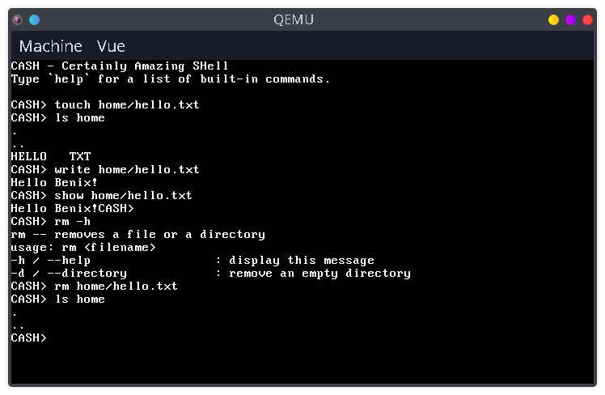

# The Benix Operating System
Benix is a small 32-bit hobby operating system for x86 I made for fun and learning. It is written in Assembly (Intel syntax) and C. Every part of the OS has been made from scratch, from the bootloader to the user space.



## Features
### Drivers
- PIC
- PS/2 keyboard
- Keyboard
- ATA
- FAT12
- VGA
- Console
### Executable file formats
- Flat binary
### Userspace
- Syscalls
- User programs
- Shell (CASH)
### Libraries
- Benlibc (a small libc for userspace programs)
- Klib (C library embedded in the kernel)
## Tools
- Installer (`tools/benix/benix`)

## Build instructions
First, you need to clone the git repository. If you don't have git, you can install it from your distribution packages.
```sh
git clone https://github.com/wither16x/benix
```
Benix does not use BASH, ZSH or any other standard shell scripting language for its build scripts. Instead, it uses [the Amber programming language](https://github.com/amber-lang/amber). Make sure it is installed on your system and run the following command:
```sh
tools/benix-installer/run -- build
```
You can also build the system on an existing FAT12 image, so it will not be reformated:
```sh
tools/benix-installer/run -- build image path/to/your/image.img
```
**Note:** you should verify the version of the OS you are building first:
```sh
tools/benix-installer/run -- version
```
Now, a floppy image should be available as `images/benix.img`.
If you have `qemu` and you want to try Benix on it, execute the command below:
```sh
tools/benix-installer/run -- emulate qemu
```
**Note**: if you need more informations about the Benix installer, run this command:
```sh
tools/benix-installer/run -- help
```
**Benix has not been tried on real hardware yet!**

## Programs
Several programs are provided within the Benix disk image. Their source code is located inside the `programs/` directory, **but they will be moved in separated repositories soon**.
- `cash` (Certainly Amazing SHell): the default shell for Benix
- `ls [dir]`: displays a list of the files
- `show <file>`: displays the content of a file in ASCII
- `info [option]`: displays informations about the system (these informations are located in `osinfo.txt`)
- `echo [text]`: displays the given text followed by a newline in the console
- `touch <file>`: creates a new empty file
- `write <file>`: writes text in a file
- `mkdir <dir>`: creates a new directory

## Documentation
There is no real documentation. Some of the code has comments, but you still need Assembly and C knowledge to understand what it does if it is not clearly explained or not explained at all...

## Contributing
To contribute to Benix:
1. Fork the git repository
2. Apply your changes
3. Test them carefully
4. Describe them in [CHANGELOG.md](CHANGELOG.md)
5. Make a detailed pull request